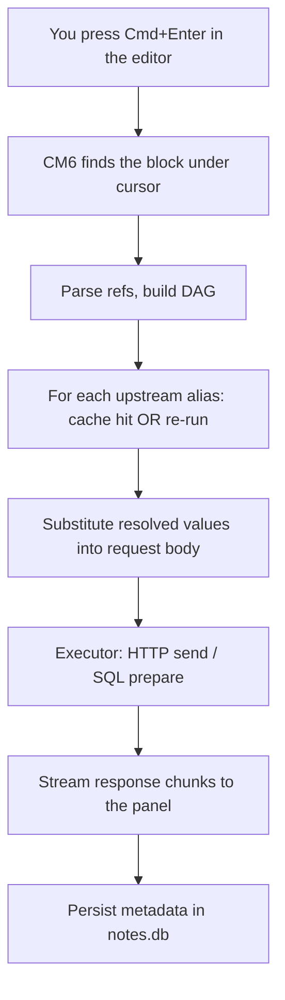
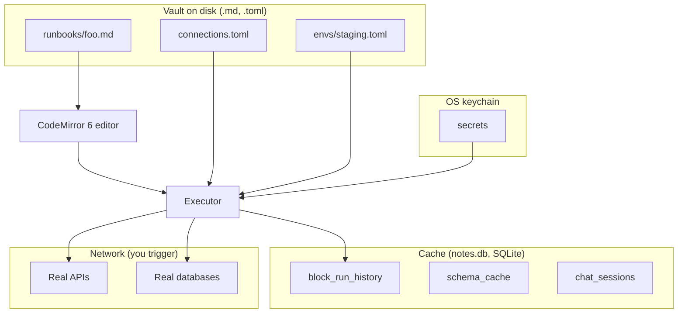

import { Aside } from "@astrojs/starlight/components";

This page traces a single block execution from the moment you press
`Cmd+Enter` through every layer down to the wire response. If
you've ever wondered "where does the response actually come from",
this is the answer.

## The 30-second version



Each step in detail below.

## Step 1 — The editor finds the block

The editor is **CodeMirror 6** with a custom extension that scans
the markdown for fenced code blocks with executable languages
(`http`, `db-*`, `diff`). When you press `Cmd+Enter`, the
extension:

1. Looks up the cursor's line.
2. Walks up/down to find the enclosing fence range (from ` ``` ` to
   the matching close).
3. Reads the **info string** on the fence line — `http alias=login
   timeout=5000`.
4. Reads the **body** — everything between the fences.
5. Builds an `ExecuteRequest { lang, info, body }` object.

The editor doesn't execute anything itself — it hands off to the
Tauri backend.

## Step 2 — Parse references, build the dependency DAG

Before sending, the backend (or a frontend resolver, depending on
block type) parses the block body for `{{...}}` expressions:

```http
POST {{BASE_URL}}/auth/login
Authorization: Bearer {{previous.body.token}}
```

For each reference:

| Token | Resolved how |
|---|---|
| `{{BASE_URL}}` | flat env-var lookup in active environment |
| `{{previous.body.token}}` | alias-ref: find the block aliased `previous` above the current one in the same file |

For alias-refs, this creates an edge in the **dependency DAG**.
Block A depends on B; B depends on C; httui topologically sorts.

References can only point **upward in the file** — making the DAG
cycle-free by construction.

## Step 3 — Cache lookup or upstream re-run

For each upstream block in the DAG, httui computes a **content
hash**:

```
sha256(method + URL + sorted headers + body
       + env-snapshot-of-referenced-vars-only)
```

If the cache (`block_run_history` table in `notes.db`) has a row
with this hash, the cached response is used — **no upstream
re-execution**. This is what makes "run block N for the 5th time"
near-instant when only block N's inputs changed.

If the hash misses, the upstream block runs (recursing into its
own dependencies if needed).

<Aside title="Mutations bypass the cache">
  POST / PUT / PATCH / DELETE HTTP methods and any mutation SQL
  (INSERT / UPDATE / DELETE / DROP / TRUNCATE) are **never served
  from cache** — they always re-execute. The cache key is computed
  but never matched against.
</Aside>

## Step 4 — Resolve references into the request

Once upstream values are available, httui substitutes them into the
current block's body, URL, headers:

```
Before substitution:
  POST {{BASE_URL}}/auth/login
  Authorization: Bearer {{previous.body.token}}

After substitution:
  POST https://staging-api.example.com/auth/login
  Authorization: Bearer eyJhbGc...
```

Substitution is **string replacement for HTTP, bind-parameter
binding for SQL**. The SQL distinction matters: in DB blocks, a
`{{user.body.id}}` reference becomes `$1` in the prepared
statement, with the resolved value bound as the parameter — zero
SQL injection surface, even if the upstream value came from a
user-controlled HTTP response.

## Step 5 — The executor

httui has one executor per block type, behind an `Executor` trait
in Rust:

| Block type | Executor | Driver |
|---|---|---|
| `http` | `HttpExecutor` | `reqwest` (Tokio async) |
| `db-postgres` / `db-mysql` / `db-sqlite` | `DbExecutor` | `sqlx` (Tokio async) |
| `diff` | (no execution — UI-only block) | — |

The HTTP executor calls `reqwest::Client::request()` with the
resolved request, then consumes `response.bytes_stream()` chunk by
chunk. Each chunk emits a `HttpChunk` event back to the frontend
via a Tauri `Channel<HttpChunk>`.

The DB executor calls `sqlx::query` with the SQL text and bind
params, awaits the result, packages rows into a `DbChunk` event.

## Step 6 — Streaming to the panel

Tauri's `Channel<T>` is a one-shot async stream from backend to
frontend. The HTTP executor emits:

```
1. HttpChunk::Headers   { status, headers, ttfb_ms }   ← immediate
2. HttpChunk::BodyChunk { bytes }                      ← repeated
3. ...
4. HttpChunk::Complete  { body (consolidated), timing, size }
```

The frontend response panel reacts to each chunk:

- **Headers** → updates the status pill + headers tab
- **BodyChunk** → bumps the "downloading X kb…" indicator (bytes
  themselves discarded — body is reconstituted in `Complete`)
- **Complete** → renders Body / Cookies / Timing / Raw tabs, persists
  the cache

If you press `Cmd+.` mid-stream, a cancel token is signalled. The
executor's `tokio::select!` observes it at every chunk boundary
and aborts — partial bytes discarded, the panel shows `[cancelled]`.

## Step 7 — Persistence

After `Complete`, httui writes to `notes.db`:

| Table | What |
|---|---|
| `block_run_history` | Metadata only — method, URL canonical, status, sizes, elapsed, timestamp. **No bodies** (privacy). Last 10 per (file, alias). |
| `cache` (in-memory + persisted) | The full response, keyed by content hash. LRU evicted. |

The response panel reads from `cache` on hover/tab switches; the
**History** drawer reads from `block_run_history`.

## Where each value lives — the storage model

httui splits data across two stores:

### Vault (filesystem)

| Path | Holds | Editable by hand? |
|---|---|---|
| `runbooks/**/*.md` | Your runbooks (the markdown) | yes |
| `connections.toml` | DB connection definitions | yes |
| `envs/*.toml` | Env variables | yes |
| `.httui/workspace.toml` | UI state (open tabs, panes) | yes (rare) |

Everything in the vault is **plain text**, committed to git,
read/writable by any editor. httui's file watcher reloads on
external changes.

### `notes.db` (SQLite, vault-local)

| Table | Holds | Regenerable? |
|---|---|---|
| `block_run_history` | Run metadata | yes (just history) |
| `connection_pool_state` | Connection health | yes |
| `chat_sessions`, `chat_messages` | Chat history | only with original prompts |
| `tool_permissions` | "Always" / "Session" permission rules from chat | yes |
| `schema_cache` | DB introspection cache | yes (re-introspects) |
| `usage_stats` | Token counts aggregated | yes |
| `fts_index` | Full-text search index over the vault | yes |

`notes.db` is **not committed** — it's a cache. Deleting it loses
chat history; everything else regenerates on next run.

### OS keychain

| Entry name pattern | Holds |
|---|---|
| `httui::env::<env>::<KEY>` | Secret env var values |
| `httui::<conn-name>::password` | DB connection passwords |
| `httui::<conn-name>::user` | DB usernames (rarely secret, but consistent) |

httui never serializes these to disk. The keychain entry name + a
sentinel in TOML / SQLite is the only record on disk that the
secret exists.

## The full picture



The Tauri backend mediates between disk, cache, keychain, and
network. The frontend (React + CM6) is the editor + panels; it
never talks to APIs directly.

## Related

- **[The mental model](/docs/explanation/mental-model)** — what a runbook is conceptually
- **[Local-first](/docs/explanation/local-first)** — why these stores live where they do
- **[Architecture](/docs/architecture)** — the deeper systems-design version of this page
- **[Block references](/docs/reference/block-references)** — the syntax that triggers the DAG
