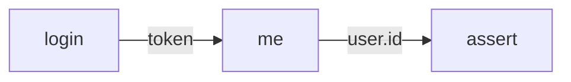

import { Aside, Steps } from "@astrojs/starlight/components";

This tutorial builds a multi-block runbook that simulates a real
end-to-end API check: authenticate, use the token, verify the result
was what you expected. It's the workflow you'll reach for every time
you debug staging or write a smoke test for CI.

**Time:** ~15 minutes · **Prereqs:** finished
[Quickstart](/docs/tutorials/quickstart).

## What you'll build

By the end you'll have a runbook with **3 chained blocks**:



- `login` → POST `/auth/login`, captures the JWT
- `me` → GET `/users/me` with the bearer token from `login`
- `assert` → an `# expect:` section that fails the runbook if `time` or `status` drift

httui handles the dependency graph automatically — running `me` runs
`login` first; running `assert` runs both.

## 1. The API you'll hit

We'll use [httpbin](https://httpbin.org) and a tiny fake-auth helper —
both public, no signup. The "login" returns whatever you send as a
fake "token", and "/anything" echoes your request so you can confirm
the bearer header reached the server.

For the assertion we'll target a fixed-shape `/json` endpoint so we can
assert on real fields.

## 2. Create the runbook

In `runbooks/`, create `auth-flow.md`. Open it and add a short intro at
the top:

````markdown
# Auth flow smoke test

A two-step login → me → assert chain to verify the staging gateway
isn't dropping bearer tokens.
````

## 3. Block 1 — login

Below the intro, paste this **HTTP block**. The `alias=login` on the
fence line names the block so we can reference it later:

````markdown
```http alias=login
POST https://httpbin.org/post
Content-Type: application/json

{
  "user": "alice",
  "device": "laptop-42"
}
```
````

Hit **`Cmd+Enter`**. You should see the httpbin echo response with your
JSON in the `json` field.

<Aside title="What the alias does">
  `alias=login` names this block. Any block below can read its captured
  response as `{{login.body.<path>}}`, `{{login.status}}`,
  `{{login.headers.<name>}}`, etc.
</Aside>

## 4. Block 2 — me (uses the token)

Now the chain. Add below:

````markdown
```http alias=me
GET https://httpbin.org/anything
Authorization: Bearer {{login.body.json.user}}-{{login.body.json.device}}
Accept: application/json
```
````

The reference `{{login.body.json.user}}-{{login.body.json.device}}`
reads `alice` and `laptop-42` out of the `login` response and uses
them as a fake bearer token. (In production you'd reference an actual
JWT field like `{{login.body.access_token}}`.)

<Steps>
1. Click anywhere in the `me` block body.
2. Press **`Cmd+Enter`**.
3. httui sees `me` depends on `login` → runs `login` first (cached from
   step 3 — instant).
4. Resolves the references, sends `me`, shows the response.
5. In the response panel, expand the `headers` field — confirm
   `Authorization: Bearer alice-laptop-42` reached httpbin.
</Steps>

You just chained two real API calls together inside one markdown file.

## 5. Block 3 — assert

Add a third block, but this time use the fixed-shape `/json` endpoint
and an `# expect:` section:

````markdown
```http alias=assert
GET https://httpbin.org/json

# expect:
#   status == 200
#   time < 1500ms
#   body.slideshow.title contains "Sample"
```
````

The `# expect:` section turns the block from "show me the response"
into "**fail the runbook if any of these aren't true**".

Hit **`Cmd+Enter`** on `assert`. You should see all three assertions
pass (green check next to each line).

<Aside type="tip" title="Now break one on purpose">
  Change `status == 200` to `status == 201`. Re-run. httui marks the
  block red, shows the expected vs actual side-by-side, and skips
  anything below in the runbook. Change it back — green again.
</Aside>

## 6. Run the whole runbook

Press **`Cmd+Shift+Enter`** (or click the **Run all** button in the
status bar). httui:

1. Builds the dependency DAG (`login` → `me`, `assert` standalone).
2. Runs them in topological order, in parallel where possible.
3. Shows pass/fail counts in the status bar.

For our 3 blocks it takes ~600ms total. In a real runbook with
20 blocks against staging, you'd see the parallel runs fan out
visibly in the panel.

## What's next

You now have the loop down: **block → capture → reference → assert**.
That's 80% of what httui is for. From here:

- **[Add a database to your runbook](/docs/tutorials/add-database)** —
  same chain idea but with SQL: fetch a row, use the id in an HTTP
  request, assert the response.
- **[Block references](/docs/reference/block-references)** — the full `{{...}}` syntax,
  scoping rules, and how `{{$prev}}` works.
- **[Environments](/docs/how-to/environments)** — `{{BASE_URL}}` and similar:
  per-env variables so the same runbook hits staging, prod, or your
  laptop tunnel.
