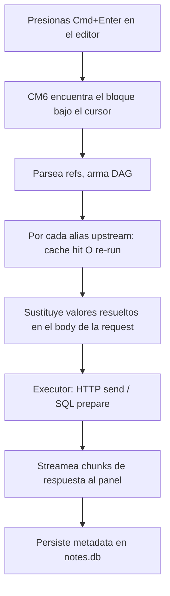
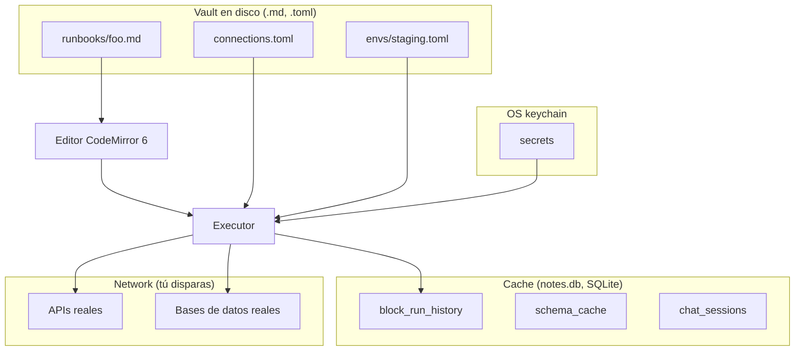

import { Aside } from "@astrojs/starlight/components";

Esta página traza una única ejecución de bloque desde el momento en
que presionas `Cmd+Enter` a través de cada capa hasta la respuesta
del wire. Si alguna vez te preguntaste "¿de dónde viene realmente la
respuesta?", esta es la respuesta.

## La versión de 30 segundos



Cada paso en detalle abajo.

## Paso 1 — El editor encuentra el bloque

El editor es **CodeMirror 6** con una extensión custom que escanea
el markdown buscando bloques fenced de código con lenguajes
ejecutables (`http`, `db-*`, `diff`). Cuando presionas `Cmd+Enter`,
la extensión:

1. Mira la línea del cursor.
2. Walka arriba/abajo para encontrar el rango envolvente de la
   fence (de ` ``` ` al cierre matching).
3. Lee el **info string** en la línea de la fence — `http
   alias=login timeout=5000`.
4. Lee el **body** — todo entre las fences.
5. Arma un objeto `ExecuteRequest { lang, info, body }`.

El editor en sí no ejecuta nada — pasa la pelota al backend Tauri.

## Paso 2 — Parse de referencias, arma el DAG de dependencias

Antes de enviar, el backend (o un resolver de frontend, depende del
block type) parsea el body del bloque buscando expresiones
`{{...}}`:

```http
POST {{BASE_URL}}/auth/login
Authorization: Bearer {{previous.body.token}}
```

Para cada referencia:

| Token | Cómo resuelve |
|---|---|
| `{{BASE_URL}}` | env-var lookup flat en el entorno activo |
| `{{previous.body.token}}` | alias-ref: encuentra el bloque aliased `previous` arriba del actual en el mismo archivo |

Para alias-refs, esto crea un edge en el **DAG de dependencias**. El
bloque A depende de B; B depende de C; httui sortea
topológicamente.

Las referencias solo pueden apuntar **hacia arriba en el archivo** —
haciendo al DAG cycle-free por construcción.

## Paso 3 — Cache lookup o re-run upstream

Para cada bloque upstream del DAG, httui computa un **content hash**:

```
sha256(method + URL + headers sorteados + body
       + env-snapshot-de-vars-referenciadas-solo)
```

Si el cache (tabla `block_run_history` en `notes.db`) tiene una
fila con este hash, se usa la respuesta cacheada — **sin re-run
upstream**. Esto es lo que hace "ejecutar el bloque N por 5ta vez"
casi-instantáneo cuando solo cambiaron los inputs del bloque N.

Si el hash falla, el bloque upstream ejecuta (recursando en sus
propias dependencias si es necesario).

<Aside title="Las mutaciones bypassean el cache">
  Los métodos HTTP POST / PUT / PATCH / DELETE y cualquier mutación
  SQL (INSERT / UPDATE / DELETE / DROP / TRUNCATE) **nunca se
  sirven desde el cache** — siempre re-ejecutan. La cache key se
  computa pero nunca se matchea.
</Aside>

## Paso 4 — Resolver referencias en la request

Una vez que los valores upstream están disponibles, httui los
sustituye en el body, URL, headers del bloque actual:

```
Antes de sustitución:
  POST {{BASE_URL}}/auth/login
  Authorization: Bearer {{previous.body.token}}

Después de sustitución:
  POST https://staging-api.example.com/auth/login
  Authorization: Bearer eyJhbGc...
```

La sustitución es **string replacement para HTTP, binding de
bind-parameter para SQL**. La distinción de SQL importa: en bloques
DB, una referencia `{{user.body.id}}` pasa a ser `$1` en el prepared
statement, con el valor resuelto bound como parámetro — cero
superficie de SQL injection, incluso si el valor upstream vino de
una respuesta HTTP controlada por el usuario.

## Paso 5 — El executor

httui tiene un executor por block type, detrás de un trait
`Executor` en Rust:

| Block type | Executor | Driver |
|---|---|---|
| `http` | `HttpExecutor` | `reqwest` (Tokio async) |
| `db-postgres` / `db-mysql` / `db-sqlite` | `DbExecutor` | `sqlx` (Tokio async) |
| `diff` | (sin ejecución — bloque UI-only) | — |

El executor HTTP llama a `reqwest::Client::request()` con la
request resuelta, luego consume `response.bytes_stream()` chunk por
chunk. Cada chunk emite un evento `HttpChunk` de vuelta al frontend
vía un `Channel<HttpChunk>` de Tauri.

El executor DB llama a `sqlx::query` con el texto SQL y los bind
params, awaitea el resultado, packagea las filas en un evento
`DbChunk`.

## Paso 6 — Streaming al panel

`Channel<T>` de Tauri es un async stream one-shot del backend al
frontend. El executor HTTP emite:

```
1. HttpChunk::Headers   { status, headers, ttfb_ms }   ← inmediato
2. HttpChunk::BodyChunk { bytes }                      ← repetido
3. ...
4. HttpChunk::Complete  { body (consolidado), timing, size }
```

El panel de respuesta del frontend reacciona a cada chunk:

- **Headers** → actualiza el status pill + tab de headers
- **BodyChunk** → bumpea el indicador "downloading X kb…" (los
  bytes mismos se descartan — el body se reconstituye en `Complete`)
- **Complete** → renderiza tabs de Body / Cookies / Timing / Raw,
  persiste el cache

Si presionas `Cmd+.` mid-stream, se señaliza un cancel token. El
`tokio::select!` del executor lo observa en cada chunk boundary y
aborta — bytes parciales descartados, el panel muestra
`[cancelled]`.

## Paso 7 — Persistencia

Después de `Complete`, httui escribe a `notes.db`:

| Tabla | Qué |
|---|---|
| `block_run_history` | Solo metadata — method, URL canonical, status, sizes, elapsed, timestamp. **Sin bodies** (privacidad). Últimos 10 por (file, alias). |
| `cache` (in-memory + persisted) | La respuesta completa, keyed por content hash. LRU evicted. |

El panel de respuesta lee de `cache` en hover/tab switches; el
drawer **History** lee de `block_run_history`.

## Dónde vive cada valor — el modelo de storage

httui splittea data entre dos stores:

### Vault (filesystem)

| Path | Contiene | ¿Editable a mano? |
|---|---|---|
| `runbooks/**/*.md` | Tus runbooks (el markdown) | sí |
| `connections.toml` | Definiciones de conexión DB | sí |
| `envs/*.toml` | Env variables | sí |
| `.httui/workspace.toml` | Estado UI (tabs abiertos, panes) | sí (raro) |

Todo en el vault es **texto plano**, committed a git, read/writable
por cualquier editor. El file watcher de httui recarga en cambios
externos.

### `notes.db` (SQLite, local del vault)

| Tabla | Contiene | ¿Regenerable? |
|---|---|---|
| `block_run_history` | Metadata de runs | sí (solo historia) |
| `connection_pool_state` | Salud de conexiones | sí |
| `chat_sessions`, `chat_messages` | Historial de chat | solo con los prompts originales |
| `tool_permissions` | Reglas "Always" / "Session" de permisos del chat | sí |
| `schema_cache` | Cache de introspección de DB | sí (re-introspecta) |
| `usage_stats` | Counts de tokens agregados | sí |
| `fts_index` | Índice full-text search sobre el vault | sí |

`notes.db` **no se commitea** — es un cache. Borrarlo pierde el
historial de chat; todo lo demás regenera en el próximo run.

### OS keychain

| Pattern del nombre de entrada | Contiene |
|---|---|
| `httui::env::<env>::<KEY>` | Valores de env vars secretas |
| `httui::<conn-name>::password` | Contraseñas de conexión DB |
| `httui::<conn-name>::user` | Usernames de DB (raramente secret, pero consistente) |

httui nunca serializa estos a disco. El nombre de la entrada del
keychain + un sentinel en TOML / SQLite es el único record en disco
de que el secret existe.

## La imagen completa



El backend Tauri media entre disk, cache, keychain y network. El
frontend (React + CM6) es el editor + panels; nunca habla con APIs
directamente.

## Relacionado

- **[El modelo mental](/es/docs/explanation/mental-model)** — qué es un runbook conceptualmente
- **[Local-first](/es/docs/explanation/local-first)** — por qué estos stores viven donde viven
- **[Arquitectura](/es/docs/architecture)** — la versión systems-design más profunda de esta página
- **[Referencias entre bloques](/es/docs/reference/block-references)** — la sintaxis que dispara el DAG
