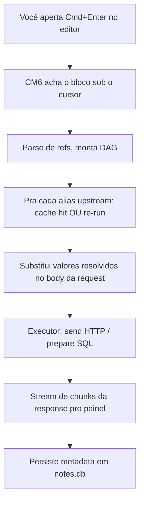
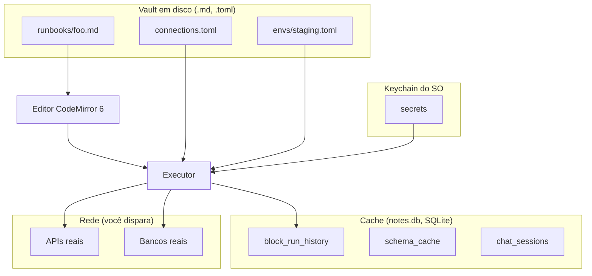

import { Aside } from "@astrojs/starlight/components";

Essa página traça uma execução única de bloco do momento que você
aperta `Cmd+Enter` por todas as camadas até a response da conexão.
Se você já se perguntou "de onde a response realmente vem", essa é
a resposta.

## A versão de 30 segundos



Cada passo em detalhe abaixo.

## Passo 1 — O editor acha o bloco

O editor é **CodeMirror 6** com uma extensão custom que escaneia o
markdown procurando blocos de código fenced com linguagens
executáveis (`http`, `db-*`, `diff`). Quando você aperta
`Cmd+Enter`, a extensão:

1. Faz lookup da linha do cursor.
2. Anda pra cima/baixo pra achar o range de fence envolvendo
   (de ` ``` ` até o close correspondente).
3. Lê a **info string** na linha do fence —
   `http alias=login timeout=5000`.
4. Lê o **body** — tudo entre os fences.
5. Constrói um objeto `ExecuteRequest { lang, info, body }`.

O editor não executa nada sozinho — passa pro backend Tauri.

## Passo 2 — Parse de referências, monta a DAG de dependências

Antes de enviar, o backend (ou um resolver no frontend, dependendo
do tipo de bloco) faz parse do body do bloco procurando expressões
`{{...}}`:

```http
POST {{BASE_URL}}/auth/login
Authorization: Bearer {{previous.body.token}}
```

Pra cada referência:

| Token | Resolvido como |
|---|---|
| `{{BASE_URL}}` | lookup flat de env-var no ambiente ativo |
| `{{previous.body.token}}` | alias-ref: acha o bloco com alias `previous` acima do atual no mesmo arquivo |

Pra alias-refs, isso cria uma aresta na **DAG de dependências**.
Bloco A depende de B; B depende de C; o httui faz ordenação
topológica.

Referências só podem apontar **pra cima no arquivo** — tornando a
DAG livre de ciclos por construção.

## Passo 3 — Lookup de cache ou re-run de upstream

Pra cada bloco upstream na DAG, o httui computa um **hash de
conteúdo**:

```
sha256(método + URL + headers ordenados + body
       + snapshot-de-env-só-das-vars-referenciadas)
```

Se o cache (tabela `block_run_history` em `notes.db`) tem uma
linha com esse hash, a response cacheada é usada — **sem
re-execução do upstream**. É isso que torna "rode o bloco N pela
5ª vez" quase instantâneo quando só os inputs do bloco N mudaram.

Se o hash não bate, o bloco upstream roda (recursando nas próprias
dependências se necessário).

<Aside title="Mutações pulam o cache">
  Métodos HTTP POST / PUT / PATCH / DELETE e qualquer SQL de
  mutação (INSERT / UPDATE / DELETE / DROP / TRUNCATE) **nunca
  são servidos do cache** — sempre re-executam. A key de cache é
  computada mas nunca casada.
</Aside>

## Passo 4 — Resolve referências na request

Uma vez que valores upstream estão disponíveis, o httui substitui
no body, URL, headers do bloco atual:

```
Antes da substituição:
  POST {{BASE_URL}}/auth/login
  Authorization: Bearer {{previous.body.token}}

Depois da substituição:
  POST https://staging-api.example.com/auth/login
  Authorization: Bearer eyJhbGc...
```

Substituição é **substituição de string pra HTTP, binding de
bind-parameter pra SQL**. A distinção do SQL importa: em blocos
DB, uma referência `{{user.body.id}}` vira `$1` na prepared
statement, com o valor resolvido bindado como parâmetro — zero
superfície de SQL injection, mesmo se o valor upstream veio de
uma response HTTP controlada pelo usuário.

## Passo 5 — O executor

O httui tem um executor por tipo de bloco, atrás de uma trait
`Executor` em Rust:

| Tipo de bloco | Executor | Driver |
|---|---|---|
| `http` | `HttpExecutor` | `reqwest` (Tokio async) |
| `db-postgres` / `db-mysql` / `db-sqlite` | `DbExecutor` | `sqlx` (Tokio async) |
| `diff` | (sem execução — bloco só de UI) | — |

O executor HTTP chama `reqwest::Client::request()` com a request
resolvida, depois consome `response.bytes_stream()` chunk por
chunk. Cada chunk emite um evento `HttpChunk` de volta pro
frontend via um `Channel<HttpChunk>` Tauri.

O executor DB chama `sqlx::query` com o texto SQL e bind params,
aguarda o resultado, empacota linhas num evento `DbChunk`.

## Passo 6 — Streaming pro painel

O `Channel<T>` do Tauri é um stream async one-shot do backend pro
frontend. O executor HTTP emite:

```
1. HttpChunk::Headers   { status, headers, ttfb_ms }   ← imediato
2. HttpChunk::BodyChunk { bytes }                      ← repetido
3. ...
4. HttpChunk::Complete  { body (consolidado), timing, size }
```

O painel de response do frontend reage a cada chunk:

- **Headers** → atualiza o pill de status + aba de headers
- **BodyChunk** → empurra o indicador "downloading X kb…" (os bytes em
  si são descartados — body é reconstituído no `Complete`)
- **Complete** → renderiza abas Body / Cookies / Timing / Raw,
  persiste o cache

Se você aperta `Cmd+.` no meio do stream, um cancel token é
sinalizado. O `tokio::select!` do executor observa em todo
boundary de chunk e aborta — bytes parciais descartados, o painel
mostra `[cancelled]`.

## Passo 7 — Persistência

Depois de `Complete`, o httui escreve em `notes.db`:

| Tabela | O quê |
|---|---|
| `block_run_history` | Só metadata — método, URL canonical, status, tamanhos, tempo decorrido, timestamp. **Sem bodies** (privacidade). Últimos 10 por (file, alias). |
| `cache` (em memória + persistido) | A response completa, chaveada por hash de conteúdo. LRU eviction. |

O painel de response lê de `cache` em hover/troca de tab; o
drawer de **History** lê de `block_run_history`.

## Onde cada valor vive — o modelo de storage

O httui divide dados em dois stores:

### Vault (filesystem)

| Path | Guarda | Editável à mão? |
|---|---|---|
| `runbooks/**/*.md` | Seus runbooks (o markdown) | sim |
| `connections.toml` | Definições de conexão DB | sim |
| `envs/*.toml` | Variáveis de env | sim |
| `.httui/workspace.toml` | Estado de UI (tabs abertos, panes) | sim (raro) |

Tudo no vault é **texto puro**, commitado no git, leitura/escrita
em qualquer editor. O file watcher do httui recarrega em mudanças
externas.

### `notes.db` (SQLite, vault-local)

| Tabela | Guarda | Regenerável? |
|---|---|---|
| `block_run_history` | Metadata de run | sim (só histórico) |
| `connection_pool_state` | Saúde da conexão | sim |
| `chat_sessions`, `chat_messages` | Histórico de chat | só com os prompts originais |
| `tool_permissions` | Regras de permissão "Always" / "Session" do chat | sim |
| `schema_cache` | Cache de introspecção DB | sim (re-introspeciona) |
| `usage_stats` | Contagens de token agregadas | sim |
| `fts_index` | Índice full-text de busca sobre o vault | sim |

`notes.db` **não é commitado** — é cache. Deletar perde histórico
de chat; tudo mais regenera na próxima run.

### Keychain do SO

| Pattern do nome de entrada | Guarda |
|---|---|
| `httui::env::<env>::<KEY>` | Valores de env var secretas |
| `httui::<conn-name>::password` | Senhas de conexão DB |
| `httui::<conn-name>::user` | Usernames DB (raramente secret, mas consistente) |

O httui nunca serializa isso pro disco. O nome da entrada do
keychain + uma sentinela no TOML / SQLite é o único registro em
disco de que o secret existe.

## O quadro completo



O backend Tauri media entre disco, cache, keychain e rede. O
frontend (React + CM6) é o editor + painéis; nunca conversa com
APIs diretamente.

## Relacionado

- **[O modelo mental](/pt-br/docs/explanation/mental-model)** — o que um runbook é conceitualmente
- **[Local-first](/pt-br/docs/explanation/local-first)** — por que esses stores vivem onde vivem
- **[Arquitetura](/pt-br/docs/architecture)** — a versão deeper de systems-design dessa página
- **[Referências entre blocos](/pt-br/docs/reference/block-references)** — a sintaxe que dispara a DAG
